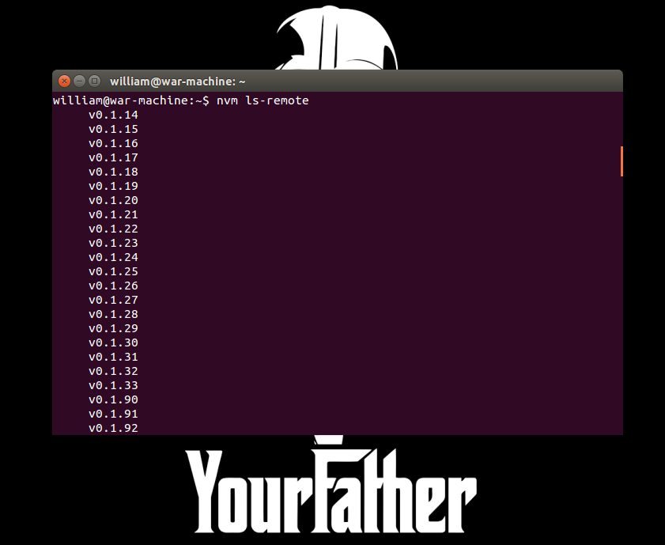
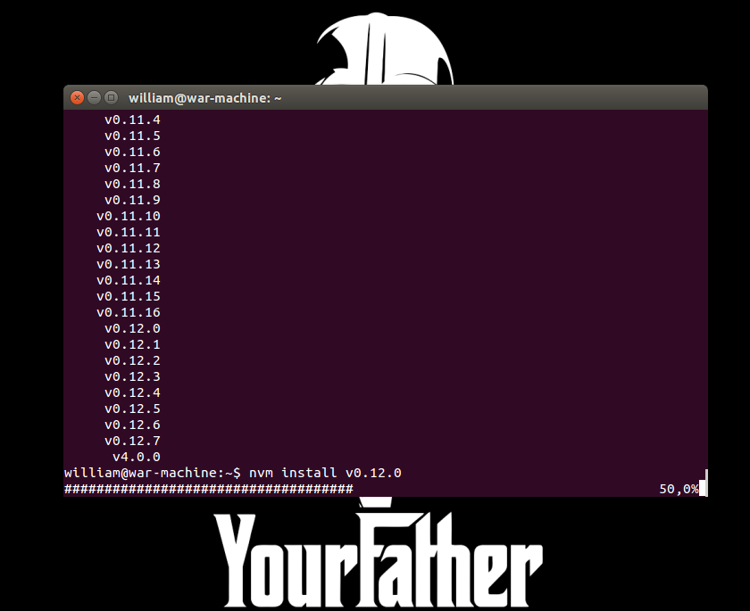
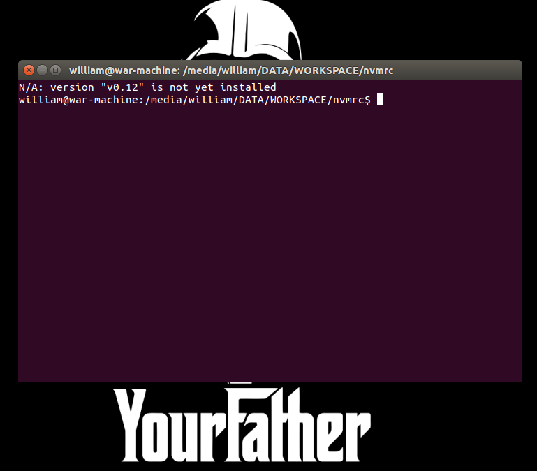
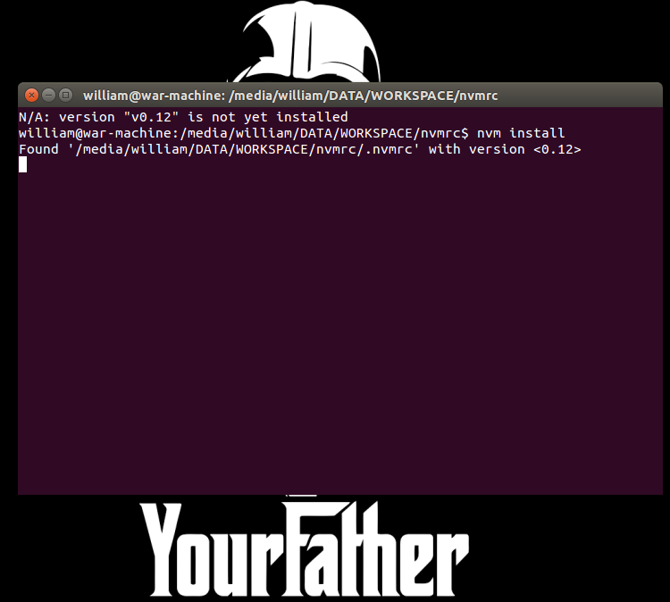

title: Utilizando versões antigas do Nodejs
categories:
  - Nodejs
  - JavaScript
  - NVM
  - NPM
tags:
  - Nodejs
  - JavaScript
  - NVM
  - NPM
date: 2015-09-12 05:00:32
description: Como utilizar mais de uma versão de Node na mesma máquina.
---
<div class="shared-img">

</div>

Se você, assim como eu, atualizou a versão do Node instalado em sua máquina para a versão [4.0.0](https://nodejs.org/en/blog/release/v4.0.0/ "Versão 4.0 do Nodejs"), pode ser que algo pare de funcionar, como no meu caso o Hexo ([Que eu utilizo para esse Blog](http://woliveiras.com.br/posts/Migrando-de-Wordpress-para-Hexo/ "Migrando de WordPress para Hexo")). Porém não precisa se desesperar, além dos módulos logo se atualizarem para a nova versão, existe uma solução simples para esse tipo de problema.<!--more-->

Existe uma ferramenta muito legal chamada [NVM (Node version manager)](https://github.com/creationix/nvm "Projeto NVM") que serve para trabalhar com mais de uma versão do Node isoladamente, parecido com o [Virtualenv](http://docs.python-guide.org/en/latest/dev/virtualenvs/) para Python.

## Instalação do NVM

Se você utiliza Linux Ubuntu/Debian ou derivados execute os seguintes comandos no seu terminal para instalação do NVM:

**Instalação das dependências**

```
sudo apt-get update
sudo apt-get install build-essential libssl-dev
```

**Instalação do NVM**

```
curl -o- https://raw.githubusercontent.com/creationix/nvm/v0.26.1/install.sh | bash
```

*Lembrando que o comando acima vai instalar a ultima versão de quando eu escrevi esse post, poranto pode estar desatualizada. Para pegar a ultima versão do NVM, acesse o link do repositório na sessão Referência desse artigo.*

Para conseguir utilizar o NVM você precisa efetuar Logoff em seu Sistema. Se não quiser deslogar agora, pode rodar o comando `source ~/.profile`

<strong>Se você utiliza Windows basta seguir [esse tutorial](https://github.com/coreybutler/nvm-windows "NVM no Windows") para a instação.</strong>

## Instalando versões isoladas do Nodejs

Para encontrar as versões disponíveis para instalação você pode executar o comando:

```
nvm ls-remote
```

As versões disponíveis para a instalação serão apresentadas.



E agora, para instalar a versão anterior necessária, basta executar o comando:

```
nvm install versão
```

No meu caso eu precisava da versão 0.12 para executar o Hexo, então executei `nvm install v0.12.0`



## Alternado as versões do Nodejs

O NVM vai executar a versão mais recente que estiver instalada por padrão, então, para executar outra versão, você precisa executar o comando:

```
nvm use versao
```

Se quiser também pode executar:

```
nvm run versao app.js
```

Para colocar a aplicação para funcionar com a versão específica somente até finalizar a mesma.

Se ouver mais de uma versão instalada, você pode executar o comando:

```
nvm ls
```

Para ver a lista das versões.

## Deixando uma versão como padrão

Se quiser setar uma versão anterior como padrão e não a mais atual, basta rodar:

```
nvm alias default versão
```

Com essas configurações você pode utilizar seus pacotes do Node instalados via [NPM](https://www.npmjs.com/) normalmente. A grande diferença será que os pacotes ficarão instalados em: `~/.nvm/node_version/lib/node_modules/`

E todo pacote instalado Global precisará ser vinculado a um pacote local para poder ser utilizado no projeto com o comando:

```
npm link pacote
```

Como no meu caso:

```
npm link hexo
```

O NVM também pode ser utilizado para isolar ambientes do io.js.

Para instalar a última versão do Node junto as antigas você pode fazer:

```
nvm install stable
```

## Utilizando o .nvmrc para especificar a versão

Quando você compartilha seu código, em algum momento será necessário especificar a versão do Node que seu projeto precisa. Você pode fazer isso através de um arquio .nvmrc ao invés de deixar em algum local como um README. - Evitando também que a outra pessoa esqueça de rodar um `nvm use versao`.

Utilize qualquer editor de texto para criação do arquivo. O mesmo deve ser criado dentro do diretório do seu projeto. Se estiver usando Windows e Notepad será necessário salvar como *"Todos os formatos"* e no *nome do arquivo* colocar ".nvmrc" (com aspas).

No arquivo coloque a versão que vai utilizar, *ex.: 0.12*.

Ao abrir o terminal em um diretório com o .nvmrc a versão será reconhecida e automaticamente configurada como se você utilizasse o comando `nvm use`.

Caso você abra o terminal nesse diretório diretório e não tenha instalado previamente a versão necessária será apresentado um erro:



Então basta rodar o comando `nvm install` e a versão especificada no arquivo será instalada automaticamente.




Rferências:
- [Digital Ocean](https://www.digitalocean.com/community/tutorials/how-to-install-node-js-with-nvm-node-version-manager-on-a-vps "Install Node and NVM on a VPS Digital Ocean.").
- [Repositório](https://github.com/creationix/nvm "NVM").
